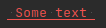
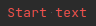
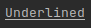
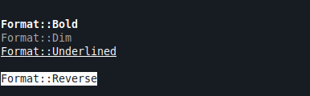
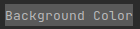
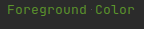
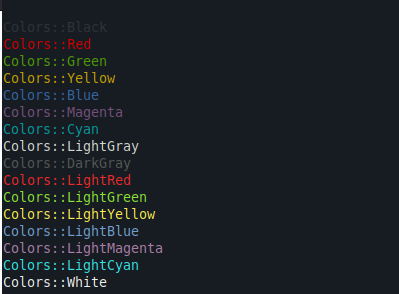
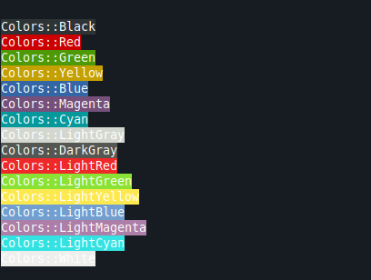
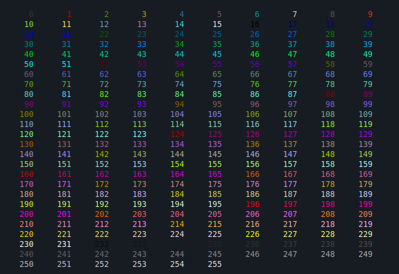
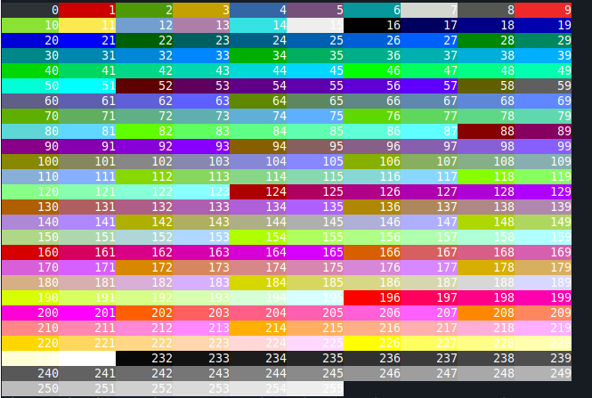

# How to use it

## Table of content

[Include it](#Include-it)
[How to use it generally](#How-to-use-it-generally.)
[Changing-Format](#Changing-Format)
[Changing foreground Color or background via enum value](#Changing-foreground-Color-or-background-via-enum-value)
[Changing foreground Color or background via unsigned numbers](#Changing-foreground-Color-or-background-via-unsigned-numbers.)

## Include it

This library provides its functionality in the namespace TStyle.
To use it, include the following header.

```cpp
#include <terminal_style/TerStyledText.hpp>
```

## How to use it generally.

The library provides a class called **TerStyledText**. This class works like builder object via 
method chaining to configure color and formatting of text.

The printing of a text can be altered in 3 areas. 

- In format: text is printed in bold or with underline
- In foreground color: Color of text
- In background color: Color behind the text.

To print out a text in certain color or format:

1. Construct a TerStyledText object.
2. Call the needed setter method to set foreground/background color, format and text to print.
3. Write this configured object to std::cout via the << operator.

## Example: Print a text with underlining and in red foreground color.

```c++
  using namespace  TStyle;
  std::cout << TerStyledText()
    .WithFormat(Format::Underlined)
    .WithFgColor(Colors::Red)
    .WithText(" Some text ") << std::endl;
```

The output will be



Note: To print out any text, you need to specify a text via 
**WithText(const std::string& toStyle)** like in the example above.

You can also specify a text as argument in the constructor.

### Example with given text in constructor

```c++
    TStyle::TerStyledText formatter{"Start text"};
    
    std::cout << formatter
    .WithFgColor(TStyle::Colors::Red)
    << std::endl;
```

Output:



## Changing Format
The format of text can be changed by the method **WithFormat(Colors newFgColor)**.

The enum **Format** contains all possible options like bold or underlining.

### Example for changing format:
```c++
  TStyle::TerStyledText formatter{};

  std::cout << formatter.WithText("Underlined")
  .WithFormat(TStyle::Format::Underlined)
  << std::endl;
```

Output:



### Possible formats:



## Changing foreground Color or background via enum value

The colors provided by the enum values are supported by most terminals. 

The foreground color of text can be changed via method **WithFgColor(Colors newFgColor)**.
The background color of text can be changed via method **WithBgColor(Colors newBgColor)**.

The enum **Colors** indicates with its constants values like Red or Blue in which color a text can
be printed.

### Example of changing background color for text
```c++
    TStyle::TerStyledText formatter{};

    std::cout << formatter.WithText("Background Color")
    .WithBgColor(TStyle::Colors::DarkGray)
    << std::endl;
```

**Output**



### Example of changing foreground color for text
```c++
    TStyle::TerStyledText formatter{};
    
    std::cout << formatter.WithText("Foreground Color")
    .WithFgColor(TStyle::Colors::Green)
    << std::endl;
```

**Output**



### Possible foreground colors via enum values: 



### Possible background colors via enum values:




## Changing foreground Color or background via unsigned numbers.

Text can be printed in extended color range. 

Note: Not all terminals support all colors in the extended range.
See this [table](https://misc.flogisoft.com/bash/tip_colors_and_formatting#terminals_compatibility)  
for compatibility 

### All possible colors for foreground



### All possible colors for background



The foreground color of text can be changed via method **WithFgColor(unsigned int newFgColor)**.
The background color of text can be changed via method **WithBgColor(unsigned int newBgColor)**.

These methods expect values between 0 and 255. These methods allow to set the foreground and 
background color in 256 different colors. Note: not all unix terminals support this color range. 

## Example using extended color range for foreground and background.

```c++
  using namespace  TStyle;
    std::cout << TerStyledText()
    .WithFgColor(88)
    .WithBgColor(6)
    .WithText(" Some text ") << std::endl;
```

Output will be:


