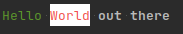

# Terminal Style

## Table of content

[Teaser](#Teaser)

[Limitation](#Limitation)

[How to integrate this library in a project](#How-to-integrate-this-library-in-a-project)

[Build options](#Build-options)

[How to use it](#How-to-use-it)

[How does it work](#How-does-it-work)

## Teaser

Servers as a library to allow print messages with a chosen foreground/background color, format 
in a linux terminal.

With this library you can do stuff like this



The code which produced this example

```c++
    using namespace TStyle;
    
    auto toPrint = TerStyledText("Hello ")
    .WithFgColor(Colors::Green);
    std::cout << toPrint;
    
    std::cout << toPrint
    .WithFgColor(Colors::Red)
    .WithBgColor(Colors::White).WithText("World");
    
    std::cout << toPrint.WithText(" out there")
    .WithFormat(Format::Bold)
    .WithFgColor(Colors::Default)
    .WithBgColor(Colors::Default)
    << std::endl;
```

## Limitation

The functionality will work only in unix terminals like XFCE4 Terminal or xTerm for example.

Library is build with **C++ 14**.

## How to integrate this library in a project

The library can be integrated via cmake.

1. Add this respo as submodule with url "https://github.com/BoolPurist/TerminalStyle.git" to your respo.
2. Include this library into pipeline via 

```cmake
add_subdirectory({path to folder submodule})
```

Now the library is included in your cmake build process. 
This library exposes a target called **terminal_style_lib** .

You can link against this target to use this library.
Link against **terminal_style_lib** via:

```cmake
target_link_libraries(<name of target to use this library> terminal_style_lib <... ohter targets>)
```

This target also adds an include-path to the folder terminal_style with all the files for this library.

### Build options

By default, only the library is build. You can also build the unit tests and the demo app.
To enable building more, add an option parameter to the cmake command:

- Add the parameter -DPROJECTS_TESTS=ON for the unit tests.
- Add the parameter -DPROJECTS_DEMO=ON for the demo app.

The demo app is an executable which prints out text with all different colors and 
formatting provided by this library.

## How to use it

See the [Guide](./Guide.md)

## How does it work

Whenever a TerStyle instance is written to an output stream, the given text
is inserted with a special encoding. This encoding has 2 parts, left one and right one.

The left and right part of the encoding is not shown on the terminal output. 
It is instead only read by the terminal to change color and formatting of a text.

The right part is always in the form ( \033[0m ) and all other text written to the output stream
is not interpreted with a format or color of a previous operation.

The left part has the following syntax 
\033[|*number for format*|;|*number of fg color*|;|*number of bg color*|m
This part determines which in which format and colors the surrounded text is printed in the terminal.

### Example: 
```cpp
  using namespace  TStyle;
  std::cout << TerStyledText()
    .WithFormat(Format::Bold)
    .WithFgColor(Colors::Red).WithBgColor(Colors::Blue)
    .WithText(" Some text ") << std::endl;
```
Will write a content ( \033[1;31;44m Some text \033[0m ) . The left part
is ( \033[1;31;44m ) and the right part is ( \033[0m ) . ( Some text ) is the text 
surrounded by the left and right part.

Link for [Additional reading](https://misc.flogisoft.com/bash/tip_colors_and_formatting)
